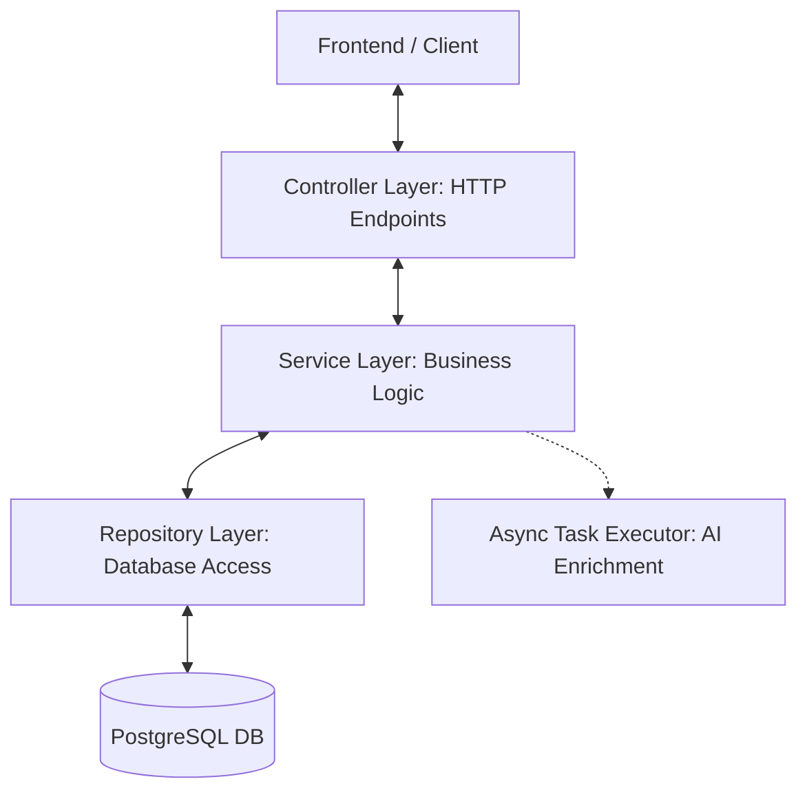
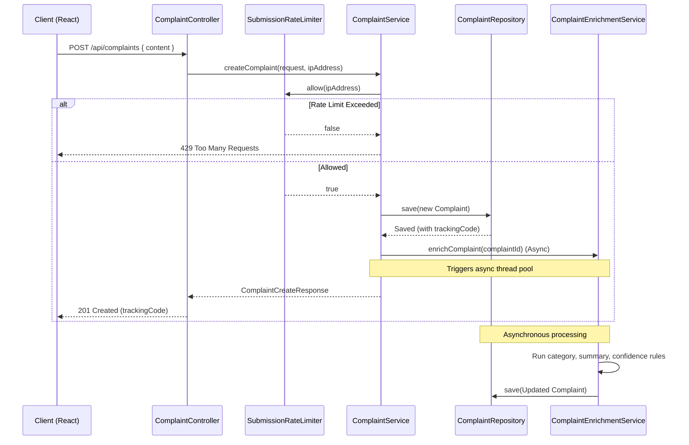
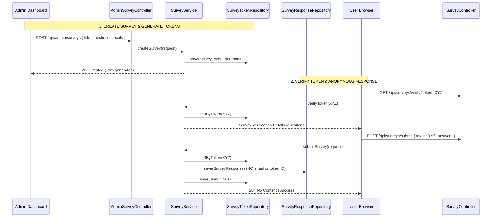

# VoiceOut Backend Architecture & Flow Guide

Welcome to the VoiceOut backend explanation! This guide explains the backend architecture from the ground up. It explains core Spring Boot and JPA concepts, lists and explains every single file in the project, details its dependencies and annotations, shows how the frontend interacts with the backend, catalogs all APIs, and addresses common questions like DTO vs Entity.

---

## 1. High-Level Architecture

The VoiceOut backend is built using **Spring Boot 3.3.2** and **Java 17**. It uses a **Layered Architecture** (or 3-Tier Architecture) where different responsibilities are isolated in separate layers:



### Core Layers & Concepts

1. **Controller Layer (Presentation Layer):** Receives HTTP requests, validates the body using Spring validation constraints, maps routes, and returns JSON responses.
2. **Service Layer (Business Logic Layer):** Executes business rules, rate limiting, transaction coordination, and coordinates background async tasks.
3. **Repository Layer (Data Access Layer):** Uses Spring Data JPA to execute database queries on PostgreSQL without writing raw SQL.
4. **Model/Entity Layer (Domain Layer):** Java classes representing SQL database tables, using JPA annotations.
5. **DTO Layer (Data Transfer Objects):** Lightweight, immutable records representing request and response payloads, decoupling database entities from the API.
6. **Config Layer (Configuration):** Configures security rules, exception handling, CORS (Cross-Origin Resource Sharing), and MVC routing.

---

## 2. Core Concepts Reference & Ground Basics

Here is a breakdown of foundational questions and concepts in Spring Boot development.

### DTO vs Entity: Why Decouple Them?

| Concept | What It Is | Purpose | Mutability |
| :--- | :--- | :--- | :--- |
| **Entity (Model)** | A Java class mapped directly to a database table structure using JPA `@Entity`. | Represents the persistent state in the database. | Mutable (changed via setters, saved by Repository). |
| **DTO (Data Transfer Object)** | A lightweight, immutable representation of data sent/received over HTTP (Java `record`). | Transfers data between client and server without exposing DB details. | Immutable (read-only, no setters). |

#### Why not just return Entities directly?
1. **Security / Privacy:** Entities often contain internal information (such as password hashes, internal status keys, or relationship maps) that should never be sent to the client. For example, a `SurveyToken` contains the recipient's email, which must never be leaked when verifying survey questions.
2. **Decoupling Database Schema from API Contract:** If you rename a column in the database, you only change the entity mapping. The JSON API contract (defined by the DTO) remains exactly the same, preventing frontend breakage.
3. **Validation Placement:** Validation rules like `@NotBlank` or `@Size` fit naturally on input DTOs representing client requests, while database constraints reside on Entities.
4. **Circular References:** Entities mapped with parent-child relationships (like `Survey` and `SurveyQuestion`) can easily trigger infinite JSON serialization loops. DTOs flatten this structure.

---

### Dependency Injection & Inversion of Control (IoC)

In standard Java, if Class A needs Class B, you write `B b = new B()`. In Spring Boot, you let the **IoC Container** handle this:
- **Spring Beans:** Classes marked with `@Component`, `@Service`, `@Repository`, or `@RestController` are scanned when the app starts. Spring instantiates them once and stores them in its memory (container) as "Beans".
- **Constructor Injection:** When Class A declares a constructor parameter of Class B, Spring automatically looks up the Class B bean and passes it in:
  ```java
  @Service
  public class MyService {
      private final MyRepository repository;
      
      // Spring automatically injects the repository bean here
      public MyService(MyRepository repository) {
          this.repository = repository;
      }
  }
  ```

---

### JPA, Hibernate, and Repository Basics

- **JPA (Java Persistence API):** A specification for Object-Relational Mapping (ORM) in Java.
- **Hibernate:** The actual framework implementing the JPA specification. It translates operations on Java objects into SQL statements.
- **Spring Data JPA Repository:** By extending `JpaRepository<Entity, IdType>`, Spring automatically generates implementation code for CRUD operations (like `.save()`, `.findById()`, `.delete()`) and parses method names (like `findByTrackingCode`) to generate corresponding SQL queries on the fly.

---

### Transactions & Async Operations

- **`@Transactional`:** Wraps a method in a database transaction. If the method completes successfully, changes are committed. If any exception occurs, all database changes made inside the method are automatically **rolled back** (undone).
- **`@Async`:** Tells Spring to run this method in a separate thread pool. The calling thread returns immediately (e.g., returning a quick response to the client) while the async thread continues running in the background.

---

### Spring Security & Basic Auth

- **Basic Authentication:** An HTTP authentication scheme where the client sends user credentials as a Base64-encoded username and password in the `Authorization` header: `Authorization: Basic <base64-credentials>`.
- **Security Interceptor:** Spring Security intercepts requests. Public endpoints (like submitting a complaint) are allowed without authentication. Admin endpoints (prefixed with `/api/admin/**`) are checked against credentials supplied in the header or active session.

---

## 3. Frontend-to-Backend Integration

In production, the frontend and backend are hosted under the same domain or proxied. During local development, they run on different ports (Frontend on `http://localhost:5173`, Backend on `http://localhost:8080`).

1. **CORS Configuration:** Browser security prevents web pages from making requests to a different domain/port. The backend configured `WebConfig.java` to allow CORS from the frontend origin, enabling cross-port API calls during local development.
2. **Credentials Propagation:** For admin authentication, the frontend uses `credentials: 'include'` in fetch calls. The backend responds with cookie-based session identifiers or parses the `Authorization` basic header.
3. **Request Body Conversion:** The frontend sends JSON stringified objects: `body: JSON.stringify(payload)`. The backend's `@RequestBody` converts this JSON into the Java DTO representation using Jackson.

---

## 4. Comprehensive REST APIs Catalog

Here is the complete list of endpoints implemented in the controllers, mapping their methods, security levels, parameters, and handler methods:

### User (Public) Endpoints

| Route | HTTP Method | Auth Level | Input Payload | Output Payload | Controller & Method | Description |
| :--- | :--- | :--- | :--- | :--- | :--- | :--- |
| `/api/complaints` | `POST` | Public | `ComplaintCreateRequest` | `ComplaintCreateResponse` | [ComplaintController.java](file:///c:/TRAINING/VoiceOut/src/backend/src/main/java/com/voiceout/controller/ComplaintController.java) -> `createComplaint` | Submits a complaint. Automatically kicks off async AI enrichment. |
| `/api/complaints/{trackingCode}` | `GET` | Public | None (Path Variable) | `ComplaintPublicResponse` | [ComplaintController.java](file:///c:/TRAINING/VoiceOut/src/backend/src/main/java/com/voiceout/controller/ComplaintController.java) -> `getComplaint` | Retrieves status and content of a complaint using its tracking code. |
| `/api/surveys/verify` | `GET` | Public | `?token=...` (Query Parameter) | `SurveyVerificationResponse` | [SurveyController.java](file:///c:/TRAINING/VoiceOut/src/backend/src/main/java/com/voiceout/controller/SurveyController.java) -> `verifyToken` | Validates a single-use survey token and returns survey questions if unused. |
| `/api/surveys/submit` | `POST` | Public | `SurveySubmitRequest` | None (HTTP 204) | [SurveyController.java](file:///c:/TRAINING/VoiceOut/src/backend/src/main/java/com/voiceout/controller/SurveyController.java) -> `submitFeedback` | Submits survey answers and marks the token as used. Decoupled for anonymity. |

---

### Admin Endpoints (Require Basic Auth / Session Authentication)

| Route | HTTP Method | Auth Level | Input Payload | Output Payload | Controller & Method | Description |
| :--- | :--- | :--- | :--- | :--- | :--- | :--- |
| `/api/admin/login` | `POST` | Admin credentials | `AdminLoginRequest` | None (HTTP 200) | [AdminAuthController.java](file:///c:/TRAINING/VoiceOut/src/backend/src/main/java/com/voiceout/controller/AdminAuthController.java) -> `login` | Validates admin credentials and establishes a session. |
| `/api/admin/complaints` | `GET` | Admin | `?status=...` (Optional Filter) | `List<AdminComplaintListItemResponse>` | [AdminController.java](file:///c:/TRAINING/VoiceOut/src/backend/src/main/java/com/voiceout/controller/AdminController.java) -> `listComplaints` | Lists all complaints ordered by creation date, optionally filtered by status. |
| `/api/admin/complaints/{complaintId}` | `GET` | Admin | None (Path Variable) | `AdminComplaintDetailResponse` | [AdminController.java](file:///c:/TRAINING/VoiceOut/src/backend/src/main/java/com/voiceout/controller/AdminController.java) -> `getComplaint` | Retrieves detailed information of a single complaint, including admin notes. |
| `/api/admin/complaints/{complaintId}/notes` | `POST` | Admin | `AdminNoteRequest` | `AdminComplaintDetailResponse` | [AdminController.java](file:///c:/TRAINING/VoiceOut/src/backend/src/main/java/com/voiceout/controller/AdminController.java) -> `addNote` | Appends a triage or follow-up note to a specific complaint. |
| `/api/admin/complaints/{complaintId}/status` | `PATCH` | Admin | `ComplaintStatusUpdateRequest` | `AdminComplaintDetailResponse` | [AdminController.java](file:///c:/TRAINING/VoiceOut/src/backend/src/main/java/com/voiceout/controller/AdminController.java) -> `updateStatus` | Updates a complaint status (e.g. from `NEW` to `RESOLVED`). |
| `/api/admin/surveys` | `GET` | Admin | None | `List<SurveySummaryResponse>` | [AdminSurveyController.java](file:///c:/TRAINING/VoiceOut/src/backend/src/main/java/com/voiceout/controller/AdminSurveyController.java) -> `listSurveys` | Summarizes surveys with response and invitation counts. |
| `/api/admin/surveys/{surveyId}` | `GET` | Admin | None (Path Variable) | `SurveyDetailsResponse` | [AdminSurveyController.java](file:///c:/TRAINING/VoiceOut/src/backend/src/main/java/com/voiceout/controller/AdminSurveyController.java) -> `getSurveyDetails` | Retrieves full survey configuration, associated tokens, and user responses. |
| `/api/admin/surveys` | `POST` | Admin | `SurveyCreateRequest` | `SurveyDetailsResponse` | [AdminSurveyController.java](file:///c:/TRAINING/VoiceOut/src/backend/src/main/java/com/voiceout/controller/AdminSurveyController.java) -> `createSurvey` | Creates a survey and seeds single-use recipient email tokens. |
| `/api/admin/surveys/{surveyId}/invitations` | `POST` | Admin | `AddInvitationsRequest` | `List<SurveyTokenResponse>` | [AdminSurveyController.java](file:///c:/TRAINING/VoiceOut/src/backend/src/main/java/com/voiceout/controller/AdminSurveyController.java) -> `addInvitations` | Appends additional recipient tokens/links to an existing survey. |

---

## 5. File-by-File Technical Deep Dive

Here is the file-by-file breakdown explaining the exact purpose, dependencies, and annotations of each component in simple terms.

### 5.1 Main Bootloader Class

#### `Application.java` ([view](file:///c:/TRAINING/VoiceOut/src/backend/src/main/java/com/voiceout/Application.java))
- **What it does:** The starting point of the whole application. Tells Spring Boot to start up and search for component classes.
- **Dependencies:** None.
- **Annotations Explained:**
  - `@SpringBootApplication`: Combines three annotations: `@Configuration` (defines custom beans), `@EnableAutoConfiguration` (auto-configs databases, security, web servers based on classpath dependencies), and `@ComponentScan` (recursively searches the directory for beans).
  - `@EnableAsync`: Activates Spring’s background execution thread pool for methods marked with `@Async` (specifically used in `ComplaintEnrichmentService`).

---

### 5.2 Config Package

#### `GlobalExceptionHandler.java` ([view](file:///c:/TRAINING/VoiceOut/src/backend/src/main/java/com/voiceout/config/GlobalExceptionHandler.java))
- **What it does:** Catches exceptions thrown anywhere in the controller layer and converts them into structured, easy-to-read JSON error responses.
- **Dependencies:** None.
- **Annotations Explained:**
  - `@ControllerAdvice`: Declares that this class intercepts exceptions globally across all controllers.
  - `@ExceptionHandler(ResponseStatusException.class)`: Directs Spring to run this method whenever a `ResponseStatusException` occurs. Returns the HTTP status and the error message as JSON.

#### `RestAuthenticationEntryPoint.java` ([view](file:///c:/TRAINING/VoiceOut/src/backend/src/main/java/com/voiceout/config/RestAuthenticationEntryPoint.java))
- **What it does:** Customizes what happens when an unauthenticated user tries to access a protected page. Instead of triggering browser basic-auth dialog boxes, it returns a standard JSON error payload with HTTP `401 Unauthorized`.
- **Dependencies:** None.
- **Annotations: Class implements `AuthenticationEntryPoint` interface.** None needed on the class itself since it is instantiated as a `@Bean` inside `SecurityConfig.java`.

#### `SecurityConfig.java` ([view](file:///c:/TRAINING/VoiceOut/src/backend/src/main/java/com/voiceout/config/SecurityConfig.java))
- **What it does:** Configures the access rules for the backend. Tells Spring Security which URLs are public (submitting complaints, answering surveys) and which require administrator authentication (all `/api/admin/**` endpoints).
- **Dependencies:** `AdminUserDetailsService`, `RestAuthenticationEntryPoint`.
- **Annotations Explained:**
  - `@Configuration`: Tells Spring this is a configuration class containing `@Bean` definition methods.
  - `@Bean`: Marks methods that return objects Spring should register as beans (e.g., `BCryptPasswordEncoder`, `SecurityFilterChain`).

#### `WebConfig.java` ([view](file:///c:/TRAINING/VoiceOut/src/backend/src/main/java/com/voiceout/config/WebConfig.java))
- **What it does:** Sets up CORS configuration. Allows requests from the React local development server (`http://localhost:5173`) to read and send cookies, headers, and HTTP request actions.
- **Dependencies:** None.
- **Annotations Explained:**
  - `@Configuration`: Declares configuration class.
  - `@Value("${voiceout.frontend-origin:http://localhost:5173}")`: Injects the frontend origin from properties.

---

### 5.3 Controller Package

#### `AdminAuthController.java` ([view](file:///c:/TRAINING/VoiceOut/src/backend/src/main/java/com/voiceout/controller/AdminAuthController.java))
- **What it does:** Exposes an admin login endpoint. Validates requests and logs users into Spring Security.
- **Dependencies:** `AuthenticationManager`.
- **Annotations Explained:**
  - `@RestController`: Marks the class as an HTTP REST endpoint returning JSON responses.
  - `@RequestMapping("/api/admin")`: Paths inside this controller start with this prefix.
  - `@PostMapping("/login")`: Listens to `POST` requests on `/api/admin/login`.
  - `@RequestBody`: Jackson converts the JSON request into `AdminLoginRequest`.

#### `AdminController.java` ([view](file:///c:/TRAINING/VoiceOut/src/backend/src/main/java/com/voiceout/controller/AdminController.java))
- **What it does:** Handles administration endpoints for viewing and managing complaints (listing, notes, status changes).
- **Dependencies:** `ComplaintService`.
- **Annotations Explained:**
  - `@RestController` and `@RequestMapping("/api/admin")`: Define route namespace.
  - `@GetMapping("/complaints")`: Handles listing complaints. Includes `@RequestParam Optional<String> status` to optionally filter rows by status.
  - `@GetMapping("/complaints/{complaintId}")`: Retrieves detail. Binds dynamic path parameters using `@PathVariable UUID complaintId`.
  - `@PostMapping("/complaints/{complaintId}/notes")`: Adds notes to complaints. Uses `@Valid` to enforce constraints in `AdminNoteRequest`.
  - `@PatchMapping("/complaints/{complaintId}/status")`: Updates complaint status.

#### `AdminSurveyController.java` ([view](file:///c:/TRAINING/VoiceOut/src/backend/src/main/java/com/voiceout/controller/AdminSurveyController.java))
- **What it does:** Handles administration endpoints for surveys (creating survey templates, checking results, listing tokens).
- **Dependencies:** `SurveyService`.
- **Annotations Explained:**
  - `@RestController` and `@RequestMapping("/api/admin/surveys")`: Base mapping.
  - `@PostMapping`: Listens to `POST /api/admin/surveys` to save survey setups and send invitations.
  - `@GetMapping`: Listens to `GET /api/admin/surveys` to get a summary list.
  - `@GetMapping("/{surveyId}")`: Handles `GET /api/admin/surveys/{surveyId}`.
  - `@PostMapping("/{surveyId}/invitations")`: Adds more invitations to an active survey.

#### `ComplaintController.java` ([view](file:///c:/TRAINING/VoiceOut/src/backend/src/main/java/com/voiceout/controller/ComplaintController.java))
- **What it does:** Public endpoint allowing users to submit new anonymous complaints and track them via a tracking code.
- **Dependencies:** `ComplaintService`.
- **Annotations Explained:**
  - `@RestController` and `@RequestMapping("/api/complaints")`: Base mapping.
  - `@PostMapping`: Submits a complaint. Receives client IP (`HttpServletRequest`) to verify rate limiting.
  - `@GetMapping("/{trackingCode}")`: Fetches a public tracking view.

#### `SurveyController.java` ([view](file:///c:/TRAINING/VoiceOut/src/backend/src/main/java/com/voiceout/controller/SurveyController.java))
- **What it does:** Public endpoints for verifying tokens and submitting feedback surveys.
- **Dependencies:** `SurveyService`.
- **Annotations Explained:**
  - `@RestController` and `@RequestMapping("/api/surveys")`: Base mapping.
  - `@GetMapping("/verify")`: Verifies if a token is valid and returns survey metadata.
  - `@PostMapping("/submit")`: Submits responses. Returns `204 No Content` on success.

---

### 5.4 Data Transfer Objects (DTO) Package

All files in this package are defined as Java **`record`s**. Records are simple immutable containers that reduce boilerplate:
- `AddInvitationsRequest.java`
- `AdminComplaintDetailResponse.java`
- `AdminComplaintListItemResponse.java`
- `AdminLoginRequest.java`
- `AdminNoteRequest.java`
- `AdminNoteViewResponse.java`
- `ComplaintCreateRequest.java` — Uses `@NotBlank` and `@Size(max = 2000)` to ensure input validity.
- `ComplaintCreateResponse.java`
- `ComplaintPublicResponse.java`
- `ComplaintStatusUpdateRequest.java` — Uses `@NotNull` to ensure status enum is present.
- `QuestionDTO.java`
- `SurveyCreateRequest.java` — Uses `@NotBlank`, `@NotEmpty` to ensure questions and emails exist.
- `SurveyDetailsResponse.java`
- `SurveyResponseView.java`
- `SurveySubmitRequest.java` — Uses `@NotBlank` for tokens and `@NotEmpty` for answers.
- `SurveySummaryResponse.java`
- `SurveyTokenResponse.java`
- `SurveyVerificationResponse.java`

---

### 5.5 Model Package (Entities)

#### `Complaint.java` ([view](file:///c:/TRAINING/VoiceOut/src/backend/src/main/java/com/voiceout/model/Complaint.java))
- **What it does:** Corresponds to the `complaints` SQL table. Stores feedback submissions, status tracking, and AI categories/summaries.
- **Dependencies:** `AdminNote` (a complaint can have multiple notes).
- **Annotations Explained:**
  - `@Entity` and `@Table(name = "complaints")`: Standard JPA mapping.
  - `@Id`: Marks `UUID id` as the primary key.
  - `@Column(name = "tracking_code", nullable = false, unique = true, length = 16)`: Maps string variable to database column properties.
  - `@Enumerated(EnumType.STRING)`: Stores enum constants (like `NEW`, `RESOLVED`) as text columns rather than integers.
  - `@OneToMany(mappedBy = "complaint", fetch = FetchType.LAZY)`: Connects notes. Marked `LAZY` so notes are not read unless accessed.
  - `@PrePersist` and `@PreUpdate`: Lifecycle callbacks to assign UUID and creation/modification timestamps automatically.

#### `AdminNote.java` ([view](file:///c:/TRAINING/VoiceOut/src/backend/src/main/java/com/voiceout/model/AdminNote.java))
- **What it does:** Maps to `admin_notes` table. Represents follow-up logs written by administrators.
- **Dependencies:** `Complaint` (each note belongs to one complaint).
- **Annotations Explained:**
  - `@Entity` and `@Table(name = "admin_notes")`: Mapping.
  - `@ManyToOne(fetch = FetchType.LAZY)`: Link back to the parent `Complaint`.
  - `@JoinColumn(name = "complaint_id", nullable = false)`: Foreign key column.

#### `AdminUser.java` ([view](file:///c:/TRAINING/VoiceOut/src/backend/src/main/java/com/voiceout/model/AdminUser.java))
- **What it does:** Maps to `admin_users` table. Holds admin credentials.
- **Dependencies:** None.
- **Annotations Explained:**
  - `@Entity` and `@Table(name = "admin_users")`: Mapping.
  - `@Column(nullable = false, unique = true)`: Enforces database-level unique username constraints.

#### `Survey.java` ([view](file:///c:/TRAINING/VoiceOut/src/backend/src/main/java/com/voiceout/model/Survey.java))
- **What it does:** Maps to `surveys` table. Holds survey details.
- **Dependencies:** `SurveyQuestion`.
- **Annotations Explained:**
  - `@OneToMany(mappedBy = "survey", cascade = CascadeType.ALL, orphanRemoval = true)`: If a survey is deleted, all its questions are deleted (`cascade`).

#### `SurveyQuestion.java` ([view](file:///c:/TRAINING/VoiceOut/src/backend/src/main/java/com/voiceout/model/SurveyQuestion.java))
- **What it does:** Maps to `survey_questions` table. Contains question text, MCQ choice lists, order sequence.
- **Dependencies:** `Survey` (belongs to one).
- **Annotations Explained:**
  - `@ElementCollection`: Maps a collection of basic types (`List<String> options`) to a separate child table without creating another entity class.
  - `@CollectionTable(name = "survey_question_options", joinColumns = @JoinColumn(name = "question_id"))`: Configures table structure.

#### `SurveyToken.java` ([view](file:///c:/TRAINING/VoiceOut/src/backend/src/main/java/com/voiceout/model/SurveyToken.java))
- **What it does:** Maps to `survey_tokens` table. Tracks single-use access credentials.
- **Dependencies:** References `surveyId` (UUID) by column value.
- **Annotations Explained:** Standard entity mapping.

#### `SurveyResponse.java` ([view](file:///c:/TRAINING/VoiceOut/src/backend/src/main/java/com/voiceout/model/SurveyResponse.java))
- **What it does:** Maps to `survey_responses` table. Stores submissions.
- **Dependencies:** References `surveyId` by value.
- **Annotations Explained:**
  - `@ElementCollection` and `@CollectionTable`: Used to map `List<String> answers` to a child answers table.

#### Enums: `ComplaintStatus.java` and `EnrichmentStatus.java`
- Standard Java enums describing domain states.

---

### 5.6 Repository Package (Data Access)

All interfaces extend `JpaRepository<Entity, UUID>` to automatically acquire database access routines:
- `AdminNoteRepository.java` — Queries notes by complaint ID.
- `AdminUserRepository.java` — Queries admins by username.
- `ComplaintRepository.java` — Queries complaints by tracking codes or statuses.
- `SurveyRepository.java` — Standard repository operations.
- `SurveyResponseRepository.java` — Queries responses and counts total submissions.
- `SurveyTokenRepository.java` — Queries tokens, checks validity.

---

### 5.7 Service Package (Business Logic)

#### `ComplaintService.java` ([view](file:///c:/TRAINING/VoiceOut/src/backend/src/main/java/com/voiceout/service/ComplaintService.java))
- **What it does:** Core service for complaints. Performs rate limit checks, saves complaints, triggers AI enrichment, gets list and detail responses, adds notes, updates status.
- **Dependencies:** `ComplaintRepository`, `AdminNoteRepository`, `ComplaintEnrichmentService`, `SubmissionRateLimiter`.
- **Annotations Explained:**
  - `@Service`: Marks it as a Spring Service Bean.
  - `@Transactional`: Controls transaction boundaries. `readOnly = true` is placed on read methods to optimize SQL engine lookups.

#### `ComplaintEnrichmentService.java` ([view](file:///c:/TRAINING/VoiceOut/src/backend/src/main/java/com/voiceout/service/ComplaintEnrichmentService.java))
- **What it does:** Performs AI enrichment on submitted complaints in the background. Summarizes input text, scores confidence, and assigns categories.
- **Dependencies:** `ComplaintRepository`.
- **Annotations Explained:**
  - `@Async`: Injects background execution. Spring runs this method in a separate thread asynchronously.
  - `@Transactional`: Saves entities within database transactions.

#### `SurveyService.java` ([view](file:///c:/TRAINING/VoiceOut/src/backend/src/main/java/com/voiceout/service/SurveyService.java))
- **What it does:** Manages surveys, validates tokens, checks verification steps, records anonymous responses, and sets token status to used.
- **Dependencies:** `SurveyRepository`, `SurveyTokenRepository`, `SurveyResponseRepository`.
- **Annotations Explained:**
  - `@Service` and `@Transactional`: Coordinates transaction-safe multiple writes (saving response while marking token used).

#### `SubmissionRateLimiter.java` ([view](file:///c:/TRAINING/VoiceOut/src/backend/src/main/java/com/voiceout/service/SubmissionRateLimiter.java))
- **What it does:** Anti-abuse spam prevention. Stores submission timestamps per IP in an in-memory queue. Allows maximum 5 submissions in 10 minutes.
- **Dependencies:** None.
- **Annotations Explained:**
  - `@Service`: Registered as a Spring Service.

#### `SeedAdminUserService.java` ([view](file:///c:/TRAINING/VoiceOut/src/backend/src/main/java/com/voiceout/service/SeedAdminUserService.java))
- **What it does:** Creates a default administrator credentials row in the DB at system boot if no admins exist.
- **Dependencies:** `AdminUserRepository`, `BCryptPasswordEncoder`.
- **Annotations Explained:**
  - `@Component`: Registers class.
  - `@Value`: Injects configuration properties from `application.properties`.
  - **Implements `CommandLineRunner`:** Overrides `run` to execute logic at startup.

#### `AdminUserDetailsService.java` ([view](file:///c:/TRAINING/VoiceOut/src/backend/src/main/java/com/voiceout/service/AdminUserDetailsService.java))
- **What it does:** Bridges Spring Security and the database. Searches `AdminUserRepository` for admin rows to authenticate logins.
- **Dependencies:** `AdminUserRepository`.
- **Annotations: `@Service`** (and implements standard security interface `UserDetailsService`).

---

## 6. Sequence Diagrams of Core Flows

### 1. Public Complaint Submission Flow
An anonymous submitter sends a complaint. It is saved immediately, returns a tracking code, and processes the AI classification in the background:



### 2. Survey Invitation and Submission Lifecycle
Administrators invite specific users. The user accesses the survey via a single-use token and submits their answers:



---

*This guide provides a comprehensive overview of the VoiceOut backend service components. Use this architecture mapping to build new modules and debug issues.*
