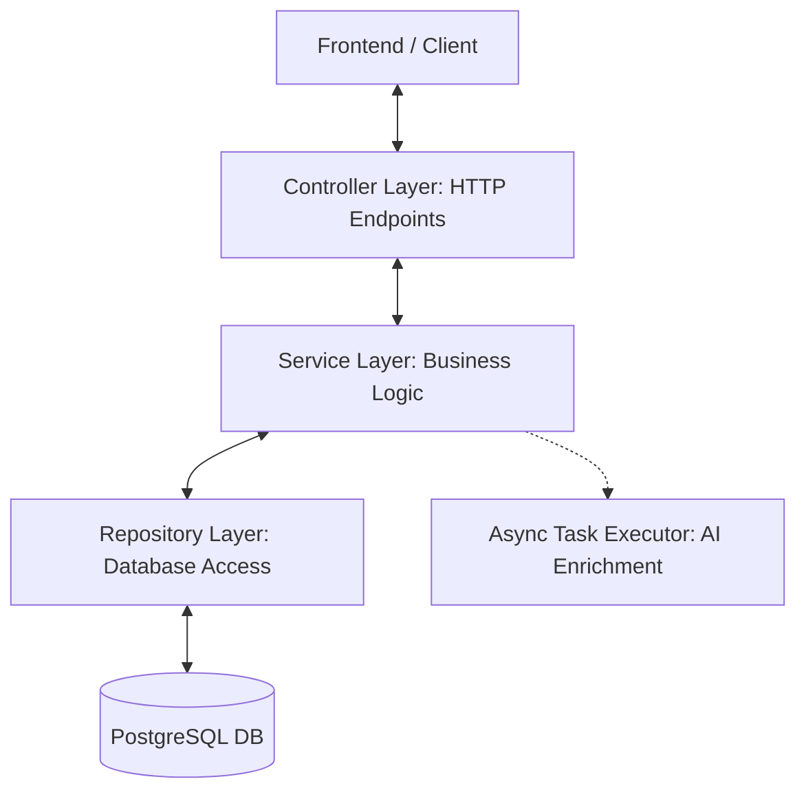
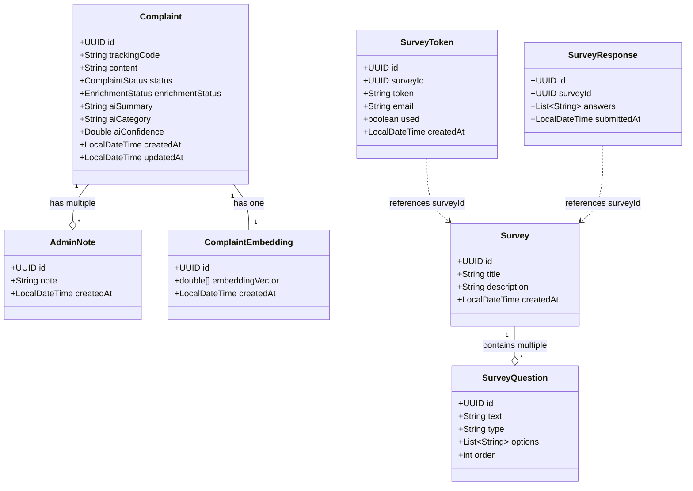
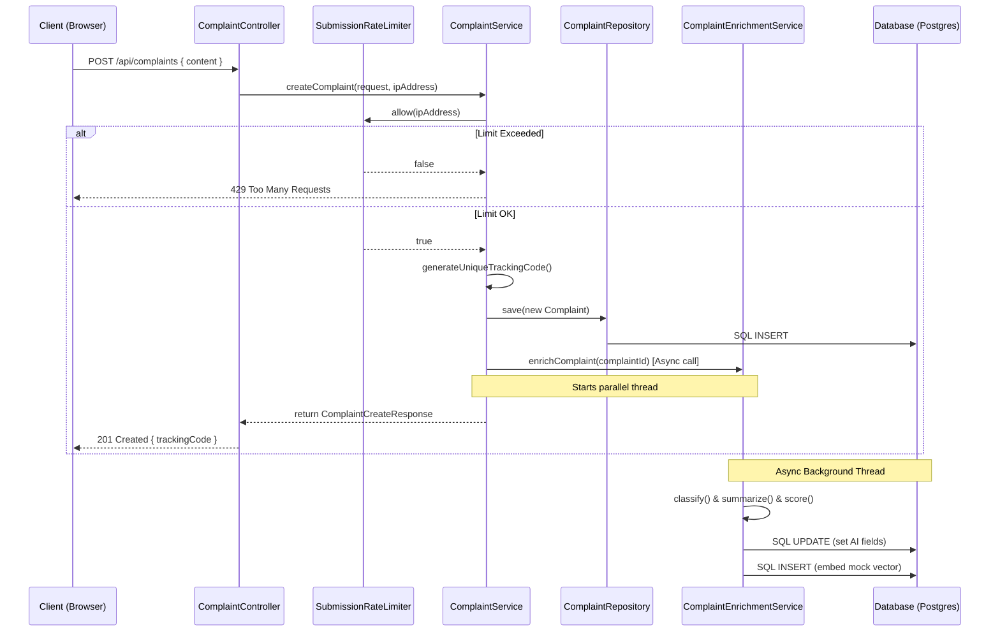
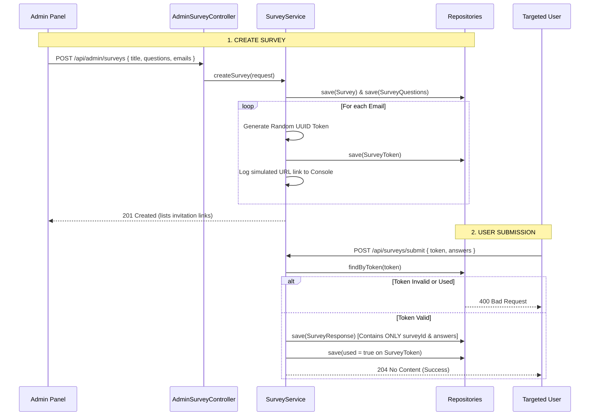

# VoiceOut Backend Architecture & Flow Guide

Welcome to the VoiceOut backend guide! This document explains the backend architecture from start to finish. It maps the project's structure to core Spring Boot concepts, shows how files depend on each other, walks through function calls, and explains Spring Boot syntax in simple terms.

---

## 1. High-Level Architecture

The VoiceOut backend is built using **Spring Boot 3.3.2** and **Java 17**. It uses a **Layered Architecture** (often called 3-Tier Architecture), which divides the codebase into distinct layers based on responsibility:



### Core Layers & Concepts

1. **Controller Layer (Presentation Layer)**
   - **Role:** Receives incoming HTTP requests, validates input data, and returns HTTP responses.
   - **Where:** `com.voiceout.controller`
2. **Service Layer (Business Logic Layer)**
   - **Role:** Contains all calculations, checks, rate limiting, async operations, and decision-making logic.
   - **Where:** `com.voiceout.service`
3. **Repository Layer (Data Access Layer)**
   - **Role:** Directly talks to the SQL database using JPA (Java Persistence API) to run CRUD (Create, Read, Update, Delete) operations.
   - **Where:** `com.voiceout.repository`
4. **Model/Entity Layer (Domain Layer)**
   - **Role:** Represents the database tables as Java objects.
   - **Where:** `com.voiceout.model`
5. **DTO Layer (Data Transfer Objects)**
   - **Role:** Lightweight containers (Java `record`s) used to transport data between the frontend and backend without exposing internal database objects.
   - **Where:** `com.voiceout.dto`
6. **Config Layer (System Settings)**
   - **Role:** Configures application behavior, security access control, CORS, and global error handling.
   - **Where:** `com.voiceout.config`

---

## 2. Spring Boot Core Concepts: Simplified

Before looking at the files, let's understand the core Spring concepts used in this project:

| Concept | Simple Explanation | How it is used in VoiceOut |
| :--- | :--- | :--- |
| **Spring Bean** | A Java object that is created, configured, and managed automatically by Spring's container. | Every controller, service, repository, and configuration class in this project is a Bean. |
| **Inversion of Control (IoC)** | Instead of you writing `new Service()` to create objects, Spring takes control of the lifecycle and instantiates them for you. | Spring initializes `ComplaintService` and passes it wherever needed. |
| **Dependency Injection (DI)** | A design pattern where Spring automatically "injects" required dependencies into a class's constructor. | When `ComplaintController` is created, Spring looks up the `ComplaintService` Bean and passes it into the constructor. |
| **JPA & Hibernate (ORM)** | **O**bject-**R**elational **M**apping. Translates database rows into Java objects and vice-versa, so you don't have to write raw SQL. | The `@Entity` class `Complaint` maps to a SQL table named `complaints`. |
| **Spring Security** | A framework that intercepts requests to check if a user is authenticated (logged in) and authorized (has permission, like `ROLE_ADMIN`). | Protects all `/api/admin/**` endpoints so only logged-in administrators can access them. |

---

## 3. Database Models & Schema Mappings

Let's examine how Java objects (Entities) map to SQL database tables.



### Detailed Entities Breakdown

#### 1. Complaint & Admin Management
*   **[Complaint.java](file:///c:/TRAINING/VoiceOut/src/backend/src/main/java/com/voiceout/model/Complaint.java):** Stores the submitted feedback.
    *   `trackingCode`: A unique 10-character code used by the submitter to review progress.
    *   `status`: State of the complaint (enum: `NEW`, `IN_PROGRESS`, `RESOLVED`, `DISMISSED`).
    *   `enrichmentStatus`: State of AI analysis (enum: `PENDING`, `DONE`, `FAILED`).
    *   `aiSummary`, `aiCategory`, `aiConfidence`: Automatic values computed asynchronously.
*   **[AdminNote.java](file:///c:/TRAINING/VoiceOut/src/backend/src/main/java/com/voiceout/model/AdminNote.java):** Contains logs/notes added by administrators to a specific complaint. Points back to a single `Complaint` via a `@ManyToOne` relationship.
*   **[ComplaintEmbedding.java](file:///c:/TRAINING/VoiceOut/src/backend/src/main/java/com/voiceout/model/ComplaintEmbedding.java):** Holds a mathematical representation of the complaint text (`double[]`) to calculate text similarities. Maps 1-to-1 (`@OneToOne`) with a `Complaint`.
*   **[AdminUser.java](file:///c:/TRAINING/VoiceOut/src/backend/src/main/java/com/voiceout/model/AdminUser.java):** Credentials for administrator login. Stores usernames and BCrypt hashed passwords.

#### 2. Feedback Surveys (Anonymous Lifecycle)
*   **[Survey.java](file:///c:/TRAINING/VoiceOut/src/backend/src/main/java/com/voiceout/model/Survey.java):** Metadata for surveys (title, description, creation date).
*   **[SurveyQuestion.java](file:///c:/TRAINING/VoiceOut/src/backend/src/main/java/com/voiceout/model/SurveyQuestion.java):** A question within a survey. Has a `@ManyToOne` link to its parent `Survey`. Contains options list (`@ElementCollection`) for MCQs.
*   **[SurveyToken.java](file:///c:/TRAINING/VoiceOut/src/backend/src/main/java/com/voiceout/model/SurveyToken.java):** A single-use link token assigned to a targeted recipient's email.
    *   `token`: Random UUID string.
    *   `used`: Boolean flag. Set to `true` when survey submitted.
*   **[SurveyResponse.java](file:///c:/TRAINING/VoiceOut/src/backend/src/main/java/com/voiceout/model/SurveyResponse.java):** Stores submitted answers.
    *   **CRITICAL DESIGN:** It only contains the `surveyId` and the list of text answers. It has **no relationship** to `SurveyToken` or the recipient's email! This guarantees that once a survey is submitted, it is impossible to match who wrote which answers, achieving complete anonymity.

---

## 4. File-by-File Dependency & Code Flow

Let's trace how requests flow through the codebase for the two primary use-cases.

### Use Case A: Creating a Public Complaint

This is what happens when an anonymous user submits a complaint from the frontend:



1.  **Incoming Request:** The client makes a `POST` request to `/api/complaints`.
2.  **Controller Interception:** `ComplaintController` receives the request. It extracts the client's IP address (`servletRequest.getRemoteAddr()`) to track spam attempts.
3.  **Service Processing:** It passes the payload to `ComplaintService.createComplaint`.
4.  **Rate Limiting:** `ComplaintService` queries `SubmissionRateLimiter.allow(ipAddress)`. This limiter checks an in-memory queue to ensure the IP hasn't submitted more than 5 complaints in 10 minutes.
5.  **Database Save:** If allowed, a new `Complaint` entity is populated with status `NEW` and a cryptographically random 10-character code. The repository saves it.
6.  **Asynchronous Enrichment:** The service triggers `ComplaintEnrichmentService.enrichComplaint(id)`. This method is marked with `@Async`, meaning Spring starts a separate thread to handle it immediately in the background so the user does not wait.
7.  **AI Classification (Rule-based Mock):** The async thread scans the text for keywords (e.g., "harass" $\rightarrow$ "harassment", "billing" $\rightarrow$ "financial").
8.  **Similarity Embeddings:** The async thread generates a vector (list of numbers representing keyword matches + character hashes) via `ComplaintVectorService` and saves it to the `complaint_embeddings` table.
9.  **Immediate Response:** While the async thread is doing calculations, the main thread has already returned a `201 Created` response to the client with their `trackingCode`.

---

### Use Case B: The Anonymous Survey Flow

Here is how administrators invite users and collect feedback anonymously:



#### Step 1: Admin Creates the Survey
1.  Admin calls `POST /api/admin/surveys` containing a title, list of questions, and a list of target recipient emails.
2.  `AdminSurveyController` passes this to `SurveyService.createSurvey`.
3.  The service writes a new `Survey` and its related `SurveyQuestion` list to the database.
4.  For every email address, the service instantiates a `SurveyToken` with a unique UUID (`UUID.randomUUID().toString()`) and `used = false`.
5.  Since sending actual emails requires an external SMTP server integration, the application logs the links to the system console:
    `SIMULATION: Sending Survey Link to: user@domain.com -> http://localhost:5173/?surveyToken=...`

#### Step 2: User Accesses & Submits
1.  The user opens the browser with the token in the URL.
2.  The frontend calls `GET /api/surveys/verify?token=...` to load the survey questions.
3.  `SurveyController` verifies that the token exists and `used == false`. If valid, it returns the survey title, description, and questions (but **never** leaks other users' submissions).
4.  The user fills in answers and clicks submit. The frontend sends a `POST /api/surveys/submit` with the answers and the token.
5.  **Anonymity Decoupling:** `SurveyService.submitSurvey` verifies the token again.
    *   It inserts a new record into `SurveyResponse` containing the `surveyId` and the text answers. There is **no email** and **no token ID** stored here.
    *   It updates the `SurveyToken` record setting `used = true`.
    *   Both updates run in a single `@Transactional` method. If either write fails, the entire request rolls back to prevent a token from being consumed without registering the answers.

---

## 5. Syntax Guide: Spring Boot Annotations vs Project Code

Let's demystify the Java annotations used throughout the code.

### 1. File Initialization & Dependency Management

#### Concept Syntax:
*   `@SpringBootApplication`: Marks the main class. Tells Spring to search all subfolders for classes marked as Beans and set up the framework.
*   `@EnableAsync`: Tells Spring to monitor methods with `@Async` and run them on a background thread pool.
*   `@Component`: Declares a generic class as a Spring Bean.
*   `CommandLineRunner`: An interface from Spring Boot. Any Bean implementing this will run its `run()` method immediately after the server starts.

#### VoiceOut Usage:
In [Application.java](file:///c:/TRAINING/VoiceOut/src/backend/src/main/java/com/voiceout/Application.java):
```java
@SpringBootApplication
@EnableAsync
public class Application {
    public static void main(String[] args) {
        SpringApplication.run(Application.class, args);
    }
}
```

In [SeedAdminUserService.java](file:///c:/TRAINING/VoiceOut/src/backend/src/main/java/com/voiceout/service/SeedAdminUserService.java):
```java
@Component
public class SeedAdminUserService implements CommandLineRunner {
    // ...
    @Override
    public void run(String... args) {
        // Runs on startup to verify/create default admin credentials
    }
}
```

---

### 2. HTTP Routing & Controller Layer

#### Concept Syntax:
*   `@RestController`: Tells Spring that this class receives HTTP requests and serialized return objects directly into JSON responses.
*   `@RequestMapping("/path")`: Base path prefix for all endpoints in this controller.
*   `@PostMapping`, `@GetMapping`, `@PatchMapping`: Maps HTTP methods (POST, GET, PATCH) to Java functions.
*   `@PathVariable`: Binds a dynamic URL segment (like `/api/complaints/{trackingCode}`) to a function parameter.
*   `@RequestParam`: Binds HTTP query parameters (like `?status=NEW`) to function parameters.
*   `@RequestBody`: Reads incoming JSON payload and converts it into a Java object.
*   `@Valid`: Tells Spring to validate constraints (like checking if input is blank or too long) before executing the method.

#### VoiceOut Usage:
In [ComplaintController.java](file:///c:/TRAINING/VoiceOut/src/backend/src/main/java/com/voiceout/controller/ComplaintController.java):
```java
@RestController
@RequestMapping("/api/complaints")
public class ComplaintController {

    private final ComplaintService complaintService;

    // Constructor Dependency Injection (DI)
    public ComplaintController(ComplaintService complaintService) {
        this.complaintService = complaintService;
    }

    @PostMapping
    public ResponseEntity<ComplaintCreateResponse> createComplaint(
            @Valid @RequestBody ComplaintCreateRequest request,
            HttpServletRequest servletRequest) {
        // ...
    }
}
```

---

### 3. Business Logic & Async Processing

#### Concept Syntax:
*   `@Service`: Identifies a class holding core business rules. Tells Spring to manage it as a singleton service.
*   `@Transactional`: Ensures database integrity. If any line of code in the method throws an exception, all database changes made inside that method are rolled back (undone).
    *   `readOnly = true` is an optimization telling Hibernate that the transaction only queries data, allowing database optimizations.
*   `@Async`: Marks a method to be run in a parallel thread pool. It must return a `CompletableFuture`.
*   `@Value("${property.name:default}")`: Injects custom configuration values from `application.properties`.

#### VoiceOut Usage:
In [SurveyService.java](file:///c:/TRAINING/VoiceOut/src/backend/src/main/java/com/voiceout/service/SurveyService.java):
```java
@Service
public class SurveyService {
    @Value("${voiceout.frontend-origin:http://localhost:5173}")
    private String frontendOrigin; // Injects property

    @Transactional
    public void submitSurvey(SurveySubmitRequest request) {
        // Either BOTH operations save or NEITHER does
        surveyResponseRepository.save(response);
        token.setUsed(true);
        surveyTokenRepository.save(token);
    }
}
```

In [ComplaintEnrichmentService.java](file:///c:/TRAINING/VoiceOut/src/backend/src/main/java/com/voiceout/service/ComplaintEnrichmentService.java):
```java
@Service
public class ComplaintEnrichmentService {
    @Async
    @Transactional
    public CompletableFuture<Void> enrichComplaint(UUID complaintId) {
        // Runs on a background thread so the submitter's response is fast
    }
}
```

---

### 4. Database Mappings (ORM / Entities)

#### Concept Syntax:
*   `@Entity`: Specifies that this class corresponds to a database table.
*   `@Table(name = "name")`: Explicitly names the SQL table.
*   `@Id`: Specifies the primary key.
*   `@Column`: Customizes column attributes (e.g. `nullable = false`, name overrides, length limits).
*   `@Enumerated(EnumType.STRING)`: Tells JPA to save enum constants as strings in the database (like "NEW") instead of integer positions (like 0).
*   `@PrePersist` / `@PreUpdate`: Callbacks that automatically trigger right before a record is saved or updated (ideal for setting timestamps or generating IDs).
*   `@OneToMany` / `@ManyToOne`: Links two entities together (e.g. a complaint has many notes).
    *   `fetch = FetchType.LAZY`: Delayed loading. The notes are not fetched from the database unless you explicitly call `.getNotes()`, saving memory and query time.
*   `@ElementCollection` / `@CollectionTable`: Used to map a collection of basic types (like a list of String options in a survey question) to a separate join table without needing a full-blown Entity.

#### VoiceOut Usage:
In [Complaint.java](file:///c:/TRAINING/VoiceOut/src/backend/src/main/java/com/voiceout/model/Complaint.java):
```java
@Entity
@Table(name = "complaints")
public class Complaint {
    @Id
    private UUID id;

    @Column(name = "tracking_code", nullable = false, unique = true, length = 16)
    private String trackingCode;

    @Enumerated(EnumType.STRING)
    @Column(nullable = false, length = 20)
    private ComplaintStatus status = ComplaintStatus.NEW;

    @OneToMany(mappedBy = "complaint", fetch = FetchType.LAZY)
    private List<AdminNote> notes = new ArrayList<>();

    @PrePersist
    public void onCreate() {
        if (id == null) {
            id = UUID.randomUUID();
        }
        createdAt = LocalDateTime.now();
    }
}
```

---

### 5. Repository Layer (Data Access)

#### Concept Syntax:
*   `JpaRepository<Entity, IdType>`: Standard Spring Data interface. Extends it to get helper functions like `.save()`, `.findById()`, `.findAll()`, `.deleteById()` out-of-the-box.
*   **Query-by-Method-Name:** Spring automatically parses method declarations to write SQL queries. For example, `findByTrackingCode` creates the exact SQL statement dynamically.

#### VoiceOut Usage:
In [ComplaintRepository.java](file:///c:/TRAINING/VoiceOut/src/backend/src/main/java/com/voiceout/repository/ComplaintRepository.java):
```java
public interface ComplaintRepository extends JpaRepository<Complaint, UUID> {
    // Spring generates: SELECT * FROM complaints WHERE tracking_code = ?
    Optional<Complaint> findByTrackingCode(String trackingCode);

    // Spring generates: SELECT COUNT(*) > 0 FROM complaints WHERE tracking_code = ?
    boolean existsByTrackingCode(String trackingCode);

    // Spring generates: SELECT * FROM complaints WHERE status = ? ORDER BY created_at DESC
    List<Complaint> findAllByStatusOrderByCreatedAtDesc(ComplaintStatus status);
}
```

---

### 6. Data Transfer Objects (DTOs)

#### Concept Syntax:
*   `record`: Introduced in Java 14/15, `record` is a concise syntax to create immutable data classes. It automatically creates constructors, getters, `equals()`, `hashCode()`, and `toString()` under the hood, replacing boilerplate code.
*   `@NotBlank`, `@Size`, `@NotEmpty`: Validation parameters applied to fields, validated by Spring before controllers run.

#### VoiceOut Usage:
In [ComplaintCreateRequest.java](file:///c:/TRAINING/VoiceOut/src/backend/src/main/java/com/voiceout/dto/ComplaintCreateRequest.java):
```java
package com.voiceout.dto;

import jakarta.validation.constraints.NotBlank;
import jakarta.validation.constraints.Size;

public record ComplaintCreateRequest(
    @NotBlank(message = "Content is required")
    @Size(max = 2000, message = "Content must be 2000 characters or fewer")
    String content
) {}
```

---

### 7. Global Exception Handling

#### Concept Syntax:
*   `@ControllerAdvice`: An interceptor class that catches any exception thrown by any controller method.
*   `@ExceptionHandler(Exception.class)`: Directs specific exceptions to be processed by a custom method to output unified error JSON.

#### VoiceOut Usage:
In [GlobalExceptionHandler.java](file:///c:/TRAINING/VoiceOut/src/backend/src/main/java/com/voiceout/config/GlobalExceptionHandler.java):
```java
@ControllerAdvice
public class GlobalExceptionHandler {

    @ExceptionHandler(ResponseStatusException.class)
    public ResponseEntity<Map<String, Object>> handleResponseStatusException(ResponseStatusException ex) {
        Map<String, Object> body = new HashMap<>();
        body.put("error", ex.getStatusCode().toString());
        body.put("message", ex.getReason());
        return ResponseEntity.status(ex.getStatusCode()).body(body);
    }
}
```

---

### 8. Spring Security Configurations

#### Concept Syntax:
*   `@Configuration`: Declares that the class configures system components.
*   `@Bean`: Methods within configuration classes that return instances to be registered as Spring Beans.
*   `SecurityFilterChain`: Defines access control rules (which paths are public vs which require credentials).
*   `UserDetailsService`: Load details of users trying to authenticate from the database.

#### VoiceOut Usage:
In [SecurityConfig.java](file:///c:/TRAINING/VoiceOut/src/backend/src/main/java/com/voiceout/config/SecurityConfig.java):
```java
@Configuration
public class SecurityConfig {

    @Bean
    public SecurityFilterChain securityFilterChain(HttpSecurity http) throws Exception {
        http
            .csrf(csrf -> csrf.disable()) // Disable CSRF (using session-based headers/tokens)
            .authorizeHttpRequests(authorize -> authorize
                .requestMatchers(HttpMethod.POST, "/api/complaints").permitAll() // Public submit
                .requestMatchers("/api/admin/**").authenticated() // Admins only
                .anyRequest().permitAll()); // Public verify/submit
        return http.build();
    }
}
```

In [AdminUserDetailsService.java](file:///c:/TRAINING/VoiceOut/src/backend/src/main/java/com/voiceout/service/AdminUserDetailsService.java):
```java
@Service
public class AdminUserDetailsService implements UserDetailsService {
    // ...
    @Override
    public UserDetails loadUserByUsername(String username) throws UsernameNotFoundException {
        // Loads user credentials from the AdminUserRepository for login check
    }
}
```

---

## 6. Directory Structure Reference

For quick navigation, here is how files are organized:

```text
src/backend/src/main/java/com/voiceout/
├── Application.java                 <-- System entry point
├── config/
│   ├── GlobalExceptionHandler.java  <-- Unified error response format
│   ├── RestAuthenticationEntryPoint.java <-- Handles 401 returns nicely
│   ├── SecurityConfig.java          <-- Controls route access (public vs admin)
│   └── WebConfig.java               <-- Configures CORS for React local dev
├── controller/
│   ├── AdminAuthController.java     <-- Login checks
│   ├── AdminController.java         <-- Admin operations on complaints (notes, status)
│   ├── AdminSurveyController.java   <-- Admin operations on surveys (create, list, add invites)
│   ├── ComplaintController.java     <-- Public endpoints to submit & track complaints
│   └── SurveyController.java        <-- Public endpoints to verify survey tokens & submit
├── dto/                             <-- Request/Response records for API traffic
├── model/                           <-- Entity classes mapping to DB tables
├── repository/                      <-- JPA interfaces generating DB queries
└── service/
    ├── AdminUserDetailsService.java <-- Authenticates administrative users
    ├── ComplaintEnrichmentService.java <-- Async AI summaries & categorization
    ├── ComplaintService.java        <-- Orchestrates complaint actions
    ├── ComplaintVectorService.java  <-- Mocks vector embeddings & cosine matches
    ├── DoubleArrayConverter.java     <-- Database serialization helper
    ├── SeedAdminUserService.java    <-- Inserts default admin on startup
    └── SubmissionRateLimiter.java   <-- Rate limiter preventing spam
```

---

*This guide should help you navigate, build on top of, and troubleshoot the VoiceOut backend with confidence.*
