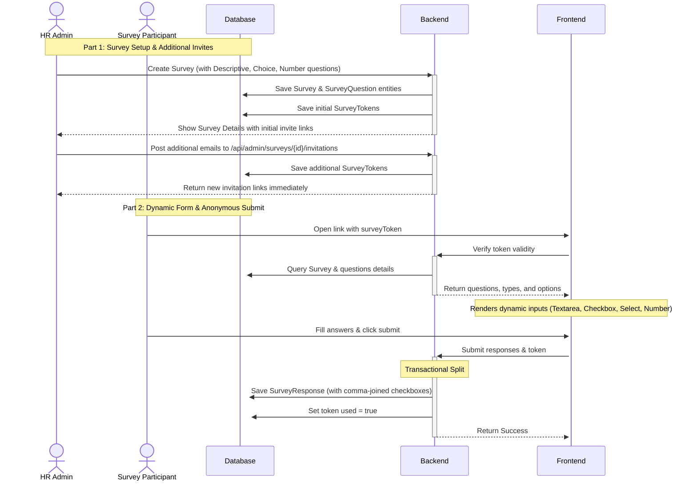

# Walkthrough: Survey Question Options & Post-Creation Invites

This document summarizes the implementation of:
1. **Dynamic Question Options/Types** (Descriptive, Checkbox selection, Select dropdown, Numbers).
2. **Post-Creation Invitations** (the ability to invite additional emails after survey setup).

---

## Architectural Workflow



---

## Detailed File Changes

### 1. Backend Changes
- **Entities**:
  - [SurveyQuestion.java](file:///c:/TRAINING/VoiceOut/src/backend/src/main/java/com/voiceout/model/SurveyQuestion.java): Newly created entity to persist question prompt, type, order, and choices. Maps to `survey_question_items` table to avoid conflicts with existing schemas.
  - [Survey.java](file:///c:/TRAINING/VoiceOut/src/backend/src/main/java/com/voiceout/model/Survey.java): Updated from a simple collection of string questions to a `@OneToMany` mapping of `SurveyQuestion` objects.
- **DTOs**:
  - [QuestionDTO.java](file:///c:/TRAINING/VoiceOut/src/backend/src/main/java/com/voiceout/dto/QuestionDTO.java): Holds text, type (`DESCRIPTIVE`, `NUMBER`, `SINGLE_CHOICE`, `MULTIPLE_CHOICE`), and list of options.
  - [AddInvitationsRequest.java](file:///c:/TRAINING/VoiceOut/src/backend/src/main/java/com/voiceout/dto/AddInvitationsRequest.java): Carries list of recipient emails to invite post-creation.
  - Updated [SurveyCreateRequest.java](file:///c:/TRAINING/VoiceOut/src/backend/src/main/java/com/voiceout/dto/SurveyCreateRequest.java), [SurveyDetailsResponse.java](file:///c:/TRAINING/VoiceOut/src/backend/src/main/java/com/voiceout/dto/SurveyDetailsResponse.java), and [SurveyVerificationResponse.java](file:///c:/TRAINING/VoiceOut/src/backend/src/main/java/com/voiceout/dto/SurveyVerificationResponse.java) to support the new `QuestionDTO` structures.
- **Business Logic & Controller**:
  - [SurveyService.java](file:///c:/TRAINING/VoiceOut/src/backend/src/main/java/com/voiceout/service/SurveyService.java):
    - Configured `createSurvey` to build child `SurveyQuestion` instances.
    - Implemented `addInvitations(UUID surveyId, AddInvitationsRequest request)` to dynamically issue additional tokens for the survey.
  - [AdminSurveyController.java](file:///c:/TRAINING/VoiceOut/src/backend/src/main/java/com/voiceout/controller/AdminSurveyController.java): Added the new endpoint `POST /api/admin/surveys/{surveyId}/invitations` for appending invites.

### 2. Frontend Changes
- **Client wrappers**:
  - [api.js](file:///c:/TRAINING/VoiceOut/src/frontend/src/api.js): Added the `adminAddSurveyInvitations` wrapper call.
- **Visual Forms**:
  - [SurveyForm.jsx](file:///c:/TRAINING/VoiceOut/src/frontend/src/pages/SurveyForm.jsx): Configured `renderQuestionInput` to dynamically build:
    - Textarea for `DESCRIPTIVE` type.
    - Numeric input for `NUMBER` type.
    - Select dropdown for `SINGLE_CHOICE` type.
    - List of styled checkboxes for `MULTIPLE_CHOICE` type (joins checked results into a comma-separated string upon submission).
- **Admin Dashboard**:
  - [AdminDashboard.jsx](file:///c:/TRAINING/VoiceOut/src/frontend/src/pages/AdminDashboard.jsx):
    - **Wizard**: Created a layout to define a question type and choice options (as comma-separated values) for each question.
    - **Detail dashboard**: Updated responses view to print question formatting and choice options. Added a new "Add More Invitations" recipient card directly under the **Invitations** sub-tab. Added a **📊 Export to Excel** button in the sub-tab header to instantly download all anonymous responses as a CSV sheet.

---

## Verification Results

### 1. Automated Unit Tests
We updated `SurveyServiceTest.java` to cover these features. Running `mvn test` succeeded:

```text
[INFO] Running com.voiceout.service.SurveyServiceTest
...
----------------------------------------
SIMULATION: Sending Survey Link to: user1@example.com
Link: http://localhost:5173/?surveyToken=a2fc68f2-cdb3-412a-bc6b-9a471f655c38
----------------------------------------
----------------------------------------
SIMULATION: Sending Additional Survey Link to: user2@example.com
Link: http://localhost:5173/?surveyToken=dec08b78-0e09-4fea-a473-66d29d91a2b0
----------------------------------------
[INFO] Tests run: 1, Failures: 0, Errors: 0, Skipped: 0, Time elapsed: 12.60 s -- in com.voiceout.service.SurveyServiceTest
[INFO] BUILD SUCCESS
```

### 2. Live Verification Steps

1. Launch both the backend Spring Boot server and React frontend Vite server.
2. Sign in as Admin, select **Feedback Surveys** -> click **+ Create New Survey**.
3. Create a questionnaire with multiple types:
   - Descriptive text question.
   - Single Choice question (choices: "Excellent, Good, Poor").
   - Multiple Choice question (choices: "Speed, Quality, Pace").
   - Number question.
4. Input target emails (e.g. `user1@example.com`), and click **Create**.
5. Copy the generated link from the **Invitations** list and open it in a browser window. Fill out the fields (checking multiple checkboxes) and submit.
6. Verify the dashboard receives this response and formats the responses clearly.
7. Switch to the **Invitations** tab, enter `user2@example.com` in the "Add More Invitations" section, and click **Add Recipients**.
8. Verify the new invitation appears instantly, and verify that opening the new link works correctly.
